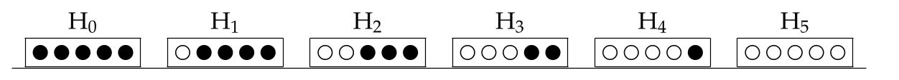

# Paolo Zinesi 2053062

```{r}
set.seed(12345)

library(ggplot2)
library(gridExtra)
```


## Functions


```{r}
# probability density function plot
prob_density_pdf <- function(df, title="Title", xlab="x", ylab="Probability density",
                             color="steelblue", size=0.5,
                             ytrans = "identity", xtrans="identity",
                             ybreaks=waiver(), xbreaks=waiver()) {
  
  pdf_plt <- ggplot(df, aes(x=x, y=y)) +
                    labs(title=title) +
                    geom_line(data=df, aes(x = x, y = y), color=color, size=size) +
                    scale_x_continuous(name = xlab, trans = xtrans, breaks = xbreaks) +
                    scale_y_continuous(name = ylab, trans = ytrans, breaks = ybreaks) +
                    theme_bw() +
                    theme(plot.title=element_text(hjust=0.5))
  
  return(pdf_plt)
}

# probability mass function plot
prob_mass_pdf <- function(df, title="Title", xlab="x", ylab="Probability",
                          color="steelblue", size=3,
                          ytrans = "identity", xtrans="identity",
                          ybreaks=waiver(), xbreaks=waiver()) {
  
  pdf_plt <- ggplot(df, aes(x=x, y=y)) +
                    labs(title=title) +
                    geom_segment(aes(x=x, xend=x, y=0, yend=y)) +
                    geom_point(size=size, color=color) + 
                    scale_x_continuous(name = xlab, trans = xtrans, breaks = xbreaks) +
                    scale_y_continuous(name = ylab, trans = ytrans, breaks = ybreaks) +
                    theme_bw() +
                    theme(plot.title=element_text(hjust=0.5))
  
  return(pdf_plt)
}

# 10-th root custom axis transformation
rt10_trans <- scales::trans_new(name="rt10",
                                transform = function(x) x**(0.1),
                                inverse = function(x) x**10)
```


## Exercise 1

Triangular distribution PDF, CDF, quantile function and random number generation (by numerical integrations).

```{r}
# PDF
dtriang <- Vectorize(FUN = function(x, a, b, c) { if ((x>=a) && (x<c)) { return(2*(x-a)/((b-a)*(c-a))) }
                                                  else if ((x>=c) && (x<=b)) { return(2*(b-x)/((b-a)*(b-c))) }
                                                  else { return(0) }},
                     vectorize.args = c('x'))

# CDF
ptriang <- Vectorize(FUN = function(q, a, b, c) { if (q<a) { return(0) }
                                                  else if (q>b) { return(1) }
                                                  else { return(integrate(dtriang, lower = a, upper = q, a, b, c)[["value"]]) }
                                                },
                     vectorize.args = c('q'))

# quantile function
qtriang <- Vectorize(FUN = function(p, a, b, c) {
                                                  uniroot(
                                                    function(q) { ptriang(q, a, b, c) - p },
                                                    interval = c(a,b))[["root"]]},
                     vectorize.args = c('p'))

# random generation
rtriang <- function(n, a, b, c) qtriang(runif(n, min = 0, max = 1), a, b, c)
```

### Exercse 1a+1b

Plot the function and write an algorithm to generate random numbers from the triangular distribution.

```{r}
a <- 0
b <- 1
c <- 0.5
x_triang <- seq(a, b, (b-a)/100)
pdf_triang <- data.frame(x=x_triang, y=dtriang(x_triang, a, b, c))

# plot function
prob_density_pdf(df = pdf_triang, title = "PDF of triangular distribution")

```

### Exercse 1c

Generate $10^4$ random number from the distribution, show them in an histogram and superimpose the analytical curve.

```{r}
hist_triang <- data.frame(x=rtriang(10**4, a, b, c))
```

```{r}
hist_plt_triang <- ggplot(hist_triang, aes(x=x)) +
                   labs(title="PDF and histograms of triangular distribution") +
                   geom_histogram(aes(y=..density..), bins = 50, color='black', fill='grey', alpha=0.7) +
                   geom_line(data=pdf_triang, aes(x = x, y = y), color='steelblue', size=1) +
                   scale_x_continuous(name ="x") +
                   scale_y_continuous(name ="Probability density") +
                   theme_bw() +
                   theme(plot.title=element_text(hjust=0.5), legend.position = c(0.85,0.85), legend.box.background = element_rect(size=0.5))

hist_plt_triang
```

## Exercise 2

Markov's inequality represents an upper bound to probability distributions. Having defined some CDFs, plot and compare them to Markov's upper bounds.

$G(k) = 1 − F(k) ≡ P(X ≥ k)$ is defined "survival probability function".

Markov's inequality states that $P(X ≥ k) ≤ \dfrac{E[X]}{k}$ for $k>0$.

```{r, fig.height=3, fig.width=4}

# Exponential with rate = 1
k_exp <- seq(0.01,10,0.01)
rate_exp <- 1
cdfres_exp <- data.frame(x=k_exp, y = 1 - pexp(k_exp, rate = rate_exp))
markov_exp <- data.frame(x=k_exp, y = (1/rate_exp)/k_exp)
cdfres_plt_exp <- prob_density_pdf(df = cdfres_exp, title = "Exponential function (λ=1)",
                                   ylab = "Survival probability (log10)", ytrans = "log10", xlab = "k") +
                  geom_line(data = markov_exp, aes(x = x, y = y, colour='Markov'), size=0.5) +
                  scale_colour_manual(values=c("orange")) +
                  labs(colour = "Bounds") +
                  theme(legend.position = c(0.83,0.83), legend.box.background = element_rect(size=0.4))

# Uniform between 3 and 5
bounds_unif <- c(3,5)
k_unif <- seq(bounds_unif[1], bounds_unif[2], length.out=200)
cdfres_unif <- data.frame(x=k_unif, y = 1 - punif(k_unif, min=bounds_unif[1], max=bounds_unif[2]))
markov_unif <- data.frame(x=k_unif, y = mean(bounds_unif)/k_unif)
cdfres_plt_unif <- prob_density_pdf(df = cdfres_unif, title = "Uniform function (3, 5)",
                                    ylab = "Survival probability", ytrans = "identity", xlab = "k") +
                  geom_line(data = markov_unif, aes(x = x, y = y, colour='Markov'), size=0.5) +
                  scale_colour_manual(values=c("orange")) +
                  labs(colour = "Bounds") +
                  theme(legend.position = c(0.83,0.83), legend.box.background = element_rect(size=0.4))

# Binomial with n = 10 and p = 1/2
n_bin <- 10
p_bin <- 1/2
k_bin <- seq(0, n_bin)
cdfres_bin <- data.frame(x=k_bin, y = 1 - pbinom(k_bin, size = n_bin, prob = p_bin))
markov_bin <- data.frame(x=k_bin[-1], y = (n_bin*p_bin)/k_bin[-1])
cdfres_plt_bin <- prob_mass_pdf(df = cdfres_bin, title = "Binomial function (n=10, p=1/2)",
                                ylab = "Survival probability", xlab = "k",
                                xbreaks = seq(0,10,2)) +
                  geom_point(data = markov_bin, aes(x = x, y = y, colour='Markov'), size=3) +
                  scale_colour_manual(values=c("orange")) +
                  labs(colour = "Bounds") +
                  theme(legend.position = c(0.83,0.83), legend.box.background = element_rect(size=0.4))

# Poisson with lambda = 1/2
lambda_pois <- 1/2
k_pois <- seq(0, 10)
cdfres_pois <- data.frame(x=k_pois, y = 1 - ppois(k_pois, lambda = lambda_pois))
markov_pois <- data.frame(x=k_pois[-1], y = lambda_pois/k_pois[-1])
cdfres_plt_pois <- prob_mass_pdf(df = cdfres_pois, title = "Poisson function (λ=1/2)",
                                 ylab = "Survival probability", xlab = "k",
                                 xbreaks = seq(0,10,2)) +
                  geom_point(data = markov_pois, aes(x = x, y = y, colour='Markov'), size=3) +
                  scale_colour_manual(values=c("orange")) +
                  labs(colour = "Bounds") +
                  theme(legend.position = c(0.83,0.83), legend.box.background = element_rect(size=0.4))


grid.arrange(cdfres_plt_exp, cdfres_plt_unif, cdfres_plt_bin, cdfres_plt_pois, nrow=2)
```

## Exercise 3

Chebyshev's inequality states that $P( |X − \mu| < k \sigma) ≥ 1 − \dfrac{1}{k^2}$ or, equivalently, $P( |X − \mu| ≥ k \sigma) ≤ \dfrac{1}{k^2}$.

```{r, fig.height=3, fig.width=4}
k_cheb <- seq(1, 7, 0.1)
cheb_pdf <- data.frame(x=k_cheb, y = 1/(k_cheb**2))

# Normal distribution with mu = 3 and sigma = 5
mu_norm <- 3
sigma_norm <- 5
cdfdiff_norm <- data.frame(x=k_cheb, y = 1 - (pnorm(mu_norm + k_cheb * sigma_norm, mean = mu_norm, sd = sigma_norm) -
                                              pnorm(mu_norm - k_cheb * sigma_norm, mean = mu_norm, sd = sigma_norm)))
cdfdiff_plt_norm <- prob_density_pdf(df = cdfdiff_norm, title = "Normal distribution (μ=3, σ=5)",
                                  xlab="k", ylab = "Probability (log10)", ytrans = 'log10') +
                  geom_line(data = cheb_pdf, aes(x = x, y = y, colour='Chebyshev'), size=0.5) +
                  scale_colour_manual(values=c("orange")) +
                  labs(colour = "Bounds") +
                  theme(legend.position = c(0.2,0.2), legend.box.background = element_rect(size=0.4))

# Exponential distribution with lambda = 1
lambda_exp <- 1
mu_exp <- 1/lambda_exp
sigma_exp <- 1/lambda_exp
cdfdiff_exp <- data.frame(x=k_cheb, y = 1 - (pexp(mu_exp + k_cheb * sigma_exp, rate = lambda_exp) -
                                             pexp(mu_exp - k_cheb * sigma_exp, rate = lambda_exp)))
cdfdiff_plt_exp <- prob_density_pdf(df = cdfdiff_exp, title = "Exponential distribution (λ=1)",
                                  xlab="k", ylab = "Probability (log10)", ytrans = 'log10') +
                  geom_line(data = cheb_pdf, aes(x = x, y = y, colour='Chebyshev'), size=0.5) +
                  scale_colour_manual(values=c("orange")) +
                  labs(colour = "Bounds") +
                  theme(legend.position = c(0.2,0.2), legend.box.background = element_rect(size=0.4))

# Uniform distribution between 1 - sqrt(2) and 1 + sqrt(2)
bounds_unif <- c(1-sqrt(2), 1+sqrt(2))
mu_unif <- mean(bounds_unif)
sigma_unif <- (bounds_unif[2]-bounds_unif[1])/sqrt(12)
cdfdiff_unif <- data.frame(x=k_cheb, y = 1 - (punif(mu_unif + k_cheb * sigma_unif, min=bounds_unif[1], max=bounds_unif[2]) -
                                              punif(mu_unif - k_cheb * sigma_unif, min=bounds_unif[1], max=bounds_unif[2])))
cdfdiff_plt_unif <- prob_density_pdf(df = cdfdiff_unif, title = "Uniform distribution (1−sqrt(2), 1+sqrt(2))",
                                  xlab="k", ylab = "Probability (10th root)", ytrans = rt10_trans, ybreaks = 10**seq(-10,0,2)) +
                  geom_line(data = cheb_pdf, aes(x = x, y = y, colour='Chebyshev'), size=0.5) +
                  scale_colour_manual(values=c("orange")) +
                  labs(colour = "Bounds") +
                  theme(legend.position = c(0.8,0.4), legend.box.background = element_rect(size=0.4))

# Poisson distribution with lambda = 1/3
lambda_pois <- 1/3
mu_pois <- lambda_pois
sigma_pois <- sqrt(lambda_pois)
cdfdiff_pois <- data.frame(x=k_cheb, y = 1 - (ppois(mu_pois + k_cheb * sigma_pois, lambda=lambda_pois) -
                                              ppois(mu_pois - k_cheb * sigma_pois, lambda=lambda_pois)))
cdfdiff_plt_pois <- prob_density_pdf(df = cdfdiff_pois, title = "Poisson distribution (λ=1/3)",
                                  xlab="k", ylab = "Probability (log10)", ytrans = "log10", ybreaks = 10**seq(-10,0,2)) +
                  geom_line(data = cheb_pdf, aes(x = x, y = y, colour='Chebyshev'), size=0.5) +
                  scale_colour_manual(values=c("orange")) +
                  labs(colour = "Bounds") +
                  theme(legend.position = c(0.2,0.2), legend.box.background = element_rect(size=0.4))

grid.arrange(cdfdiff_plt_norm, cdfdiff_plt_exp, cdfdiff_plt_unif, cdfdiff_plt_pois, nrow=2)

```

## Exercise 4 - Functions

```{r}
plot_extractions <- function(df, N_box, show_legend=FALSE, title="", xlab="N extraction", ylab="Probability", size=5) {
  
                            plt <- ggplot(data = df) +
                                   labs(title=title, fill = "Extractions") +
                                   geom_point(aes(x=indx, y=get(paste("H",N_box, sep="")), fill=cols),
                                              shape=21, size=size, colour="black") +
                                   scale_x_continuous(name=xlab, breaks = df$indx[seq(1,length(df$indx),3)]) +
                                   scale_y_continuous(name=ylab, limits = c(0,1)) +
                                   scale_fill_manual(values = c(Start="firebrick", W="white", B="black")) +
                                   theme_bw() +
                                   theme(legend.position = "top", plot.title=element_text(hjust=0.5))
                            
                            return(plt)
}
```

## Exercise 4

Six Boxes Toy Model: inference.



```{r}
probs <- rep(1/6, 6)
probs_all <- data.frame(matrix(data = probs, ncol = 6))
res <- c()
cat(c("Box probabiities: ",paste("P(H", 0:5, ")", sep = ""), "\n"))
cat("Before any extraction : probabilities =", signif(probs,2), "\n\n")

i <- 1
brk <- FALSE

# iterative computation of probabilities
while (!brk) {
  
  # open dialog window
  extr <- menu(c("White","Black","Exit"),
              graphics=TRUE,
              title=paste("Extraction #",i))
  
  
  if(extr==1) { # white ball extracted
    
    res <- c(res, extr)
    
    # update probabilities
    for (j in 0:5) {
      probs[j+1] <- (j/5) * probs[j+1]
    }
    
  }
  else if(extr==2) { # black ball extracted
    
    res <- c(res, extr)
    
    # update probabilities
    for (j in 0:5) {
      probs[j+1] <- (1- (j/5)) * probs[j+1]
    }
    
  }
  else {
    brk <- TRUE
    break
  }
 
  # normalize and append probabilities
  probs <- probs/sum(probs)
  probs_all <- rbind(probs_all, probs)
  
  # print probabilities on standard output
  cat("After extraction #",i,": probabilities =", signif(probs,2), "\n")
  
  i <- i+1
}

# creation of dataframe
colnames(probs_all) <- paste("H", 0:5, sep = "")
rownames(probs_all) <- 1:i
probs_all$indx <- as.numeric(row.names(probs_all))-1
probs_all$cols <- c("Start", c("W","B")[res])
```

```{r, fig.height=5, fig.width=4}
grid.arrange(plot_extractions(probs_all, 0, title="Probabilities vs extractions (experiment)", ylab = "P(H0)"),
             plot_extractions(probs_all, 1, title="Probabilities vs extractions (experiment)", ylab = "P(H1)"),
             plot_extractions(probs_all, 2, title="", ylab = "P(H2)"),
             plot_extractions(probs_all, 3, title="", ylab = "P(H3)"),
             plot_extractions(probs_all, 4, title="", ylab = "P(H4)"),
             plot_extractions(probs_all, 5, title="", ylab = "P(H5)"),
             nrow=3)
```


## Exercise 5

Six Boxes Toy Model: simulation.


```{r}
# sampling from random box
N_rand_box <- sample(0:5, 1)
N_max <- 20
res <- sample(c("W","B"), size=N_max, replace = TRUE, prob = c(N_rand_box/5, 1-(N_rand_box/5)))

```


Compute probabilities from the simulated data.

```{r}
probs_sim <- rep(1/6, 6)
probs_all_sim <- data.frame(matrix(data = probs_sim, ncol = 6))
cat(c("Box probabiities: ",paste("P(H", 0:5, ")", sep = ""), "\n"))
cat("Before any extraction : probabilities =", signif(probs_sim,2), "\n\n")

# iterative computation of probabilities
for(i in 1:N_max) {
  
  if(res[i]=="W") { # white ball extracted
    
    # update probabilities
    for (j in 0:5) {
      probs_sim[j+1] <- (j/5) * probs_sim[j+1]
    }
    
  }
  else if(res[i]=="B") { # black ball extracted
    
    # update probabilities
    for (j in 0:5) {
      probs_sim[j+1] <- (1- (j/5)) * probs_sim[j+1]
    }
    
  }
  
  # normalize and append probabilities
  probs_sim <- probs_sim/sum(probs_sim)
  probs_all_sim <- rbind(probs_all_sim, probs_sim)
  
  # print probabilities on standard output
  cat("After extraction #",i,": probabilities =", signif(probs_sim,2), "\n")
  
}

# creation of dataframe
colnames(probs_all_sim) <- paste("H", 0:5, sep = "")
rownames(probs_all_sim) <- 1:(N_max+1)
probs_all_sim$indx <- as.numeric(row.names(probs_all_sim))-1
probs_all_sim$cols <- c("Start", res)

```


```{r, fig.height=5, fig.width=4}
grid.arrange(plot_extractions(probs_all_sim, 0, title="Probabilities vs extractions (simulation)", ylab = "P(H0)"),
             plot_extractions(probs_all_sim, 1, title="Probabilities vs extractions (simulation)", ylab = "P(H1)"),
             plot_extractions(probs_all_sim, 2, title="", ylab = "P(H2)"),
             plot_extractions(probs_all_sim, 3, title="", ylab = "P(H3)"),
             plot_extractions(probs_all_sim, 4, title="", ylab = "P(H4)"),
             plot_extractions(probs_all_sim, 5, title="", ylab = "P(H5)"),
             nrow=3)
```


